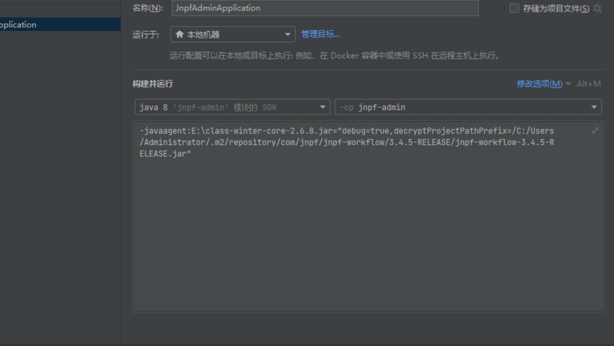
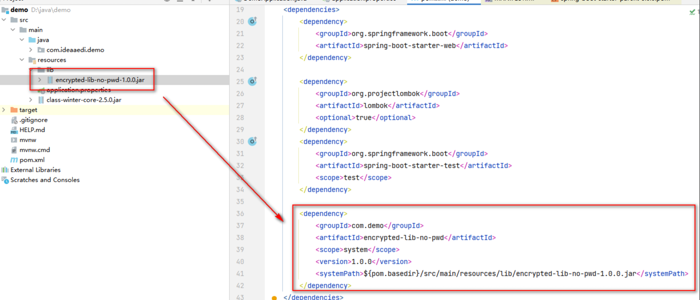
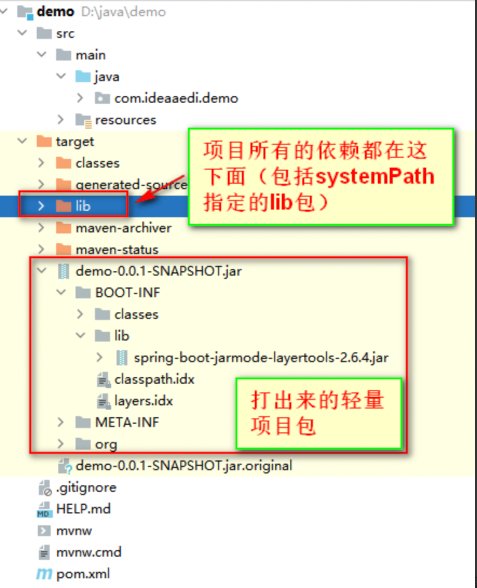
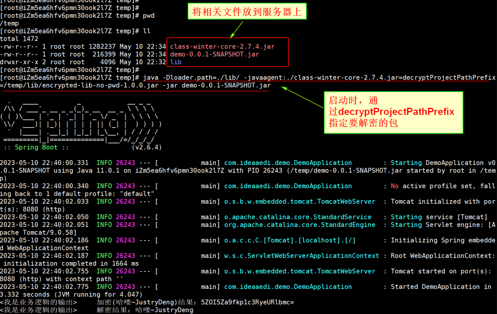
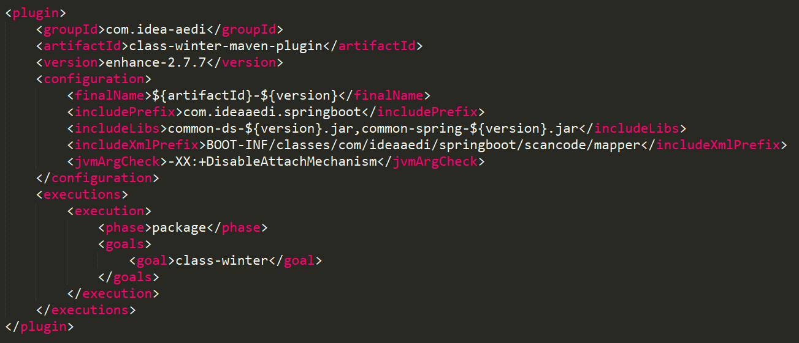

# 实现代码混淆/加密，防止反编译

## 代码混淆之class-winter

### class-winter
#### 环境要求

- 支持jdk8语法的环境即可
  本人构建class-winter时，用的jdk版本为：1.8.0_281
  注：tomcat版本不能低于8（部分小版本低的tomcat8可能也不行），否则可能报错
```java
    org.apache.catalina.LifecycleException: Failed to start component [StandardEngine[Catalina].StandardHost...
```
  注：如果有兼容低版本jdk的需求，可以自己下载master分支代码，进行对应修改

#### 功能与特性

- 支持war（普通war+可执行war）加密
- 支持jar（普通jar+可执行jar）加密
- 支持xml加密（掩耳盗铃版）

#### 加密

- 方式一：通过maven插件自动加密
```xml
<!--
    class-winter插件``
    注:自Maven3.0.3起, 绑定到同一phase的Maven插件将按照pom.xml中声明的顺序执行
    注:此插件最好放置在同一phase的最后执行。
    注:此插件不具备打包功能，需要在此插件前有打包插件进行项目打包，否则加密不会生效。
-->
<plugin>
    <groupId>com.idea-aedi</groupId>
    <artifactId>class-winter-maven-plugin</artifactId>
    <version>2.8.6</version>
    <!-- 相关配置 -->
    <configuration>
        <!-- <finalName></finalName>-->
        <includePrefix>加密范围</includePrefix>
        <!-- <originJarOrWar>非必填（不填则自动获取）</originJarOrWar>-->
        <!-- <excludePrefix></excludePrefix>-->
        <!-- <includeXmlPrefix></includeXmlPrefix>-->
        <!-- <excludeXmlPrefix></excludeXmlPrefix>-->
        <!-- <toCleanXmlChildElementName></toCleanXmlChildElementName>-->
        <!-- <password></password>-->
        <!-- <includeLibs></includeLibs>-->
        <!-- <alreadyProtectedRootDir></alreadyProtectedRootDir>-->
        <!-- <alreadyProtectedLibs></alreadyProtectedLibs>-->
        <!-- <supportFile></supportFile>-->
        <!-- <jvmArgCheck></jvmArgCheck>-->
        <!-- <tips></tips>-->
        <!-- <debug></debug>-->
    </configuration>
    <executions>
        <execution>
            <phase>package</phase>
            <goals>
                <goal>class-winter</goal>
            </goals>
        </execution>
    </executions>
</plugin>
```
  注：不必担心信息泄漏问题，使用此方式生成混淆的jar包时，会擦除pom.xml中关于class-winter-plugin的信息。
- 方式二：通过 class-winter-core.jar 主动加密
```java
  java -jar class-winter-core-2.8.6.jar originJarOrWar=${要加密的项目.jar或.war包} includePrefix=${加密范围} [k3=v3 k4=v4 ...]
  # 对于复杂的参数值，可以使用引号引起来
  # linux
  java -jar class-winter-core-2.8.6.jar k1='v1' k2='v2'
  # windows
  java -jar class-winter-core-2.8.6.jar k1="v1" k2="v2"
```  

#### 加密参数

提示：慎用cca（尤其）、cma、cfa参数，如果要用，请做好充分测试。

原因说明：部分框架在获取某些元数据时，并不全都从已被premain处理后的类中读取，而是直接去对应位置读取资源文件本身（如：spring的SimpleMetadataReader implements MetadataReader直接去读取.class文件本身，以知道是否需要将类注册进容器等），因为class-winter会对该位置的资源进行加密（如：使用cca、cma、cfa时会擦除类、方法、字段上的注解信息），因此此时如果直接去.class文件本身获取元信息的话，可能会丢失部分信息（如：被class-winter擦除了的类的注解信息就读取不到）

解决办法：可以考虑对相关逻辑进行定制，使其不从已加密的.class中获取相关信息（如：spring框架可考虑定制MetadataReader）

<table><tbody><tr align="center"><td>参数</td><td>是否必填</td><td>说明</td><td>示例</td></tr><tr align="center"><td>originJarOrWar</td><td>是</td><td>指定要加密的jar/war文件<br>注：当使用maven插件进行自动加密时，此参数非必填，不填则自动获取。<br>注：当使用maven插件进行自动加密时，可结合maven相关占位符进行相对定位。如：${project.basedir}/../../your-project.jar</td><td>originJarOrWar=/my-project.jar</td></tr><tr align="center"><td>includePrefix</td><td>是</td><td>通过前缀匹配的形式定位要加密的class，支持正则匹配<br>注：多个通过逗号分割。</td><td>includePrefix=com<br>includePrefix=com,org<br>includePrefix=com.*.dao,org</td></tr><tr align="center"><td>cca（依托于includePrefix）</td><td>否</td><td>作为includePrefix的附加设置，设置是否清空类上的注解（写法同url后面设置参数）</td><td>includePrefix=com?cca=true</td></tr><tr align="center"><td>cma（依托于includePrefix）</td><td>否</td><td>作为includePrefix的附加设置，设置是否清空方法上的注解（写法同url后面设置参数）</td><td>includePrefix=com?cca=true&amp;cma=true</td></tr><tr align="center"><td>cfa（依托于includePrefix）</td><td>否</td><td>作为includePrefix的附加设置，设置是否清空字段上的注解（写法同url后面设置参数）</td><td>includePrefix=com?cca=true&amp;cma=true&amp;cfa=true</td></tr><tr align="center"><td>caPrefix（依托于cca、cma、cfa开关）</td><td>否</td><td>作为includePrefix的附加设置，依托与cca、cma、cfa开关，清空类、方法、字段上的指定注解（写法同url后面设置参数）<br>注：多个通过|分割，注解请写完全路径例如：com.xx.anno.MyAnnotation</td><td>includePrefix=com?cca=true&amp;cma=true&amp;cfa=true&amp;caPrefix=com.xx.anno.MyAnnotation|com.bb.anno.MyAnnotation</td></tr><tr align="center"><td>excludePrefix</td><td>否</td><td>通过前缀匹配的形式排除class，不对其加密，支持正则匹配<br>注：多个通过逗号分割。<br>注:excludePrefix优先级高于includePrefix。</td><td>excludePrefix=com.example.service,com.example.util.*.class</td></tr><tr align="center"><td>includeXmlPrefix</td><td>否</td><td>通过打出来的包中条目的entryName前缀匹配的形式定位要加密的xml，支持正则匹配<br>注：多个通过逗号分割。<br>注：如果您打出来的加密包是准备作为一个lib包提供给第三方使用的，那么请不要使用此参数，因为解密时是不会解密项目所依赖的lib包中的xml的。</td><td>includeXmlPrefix=BOOT-INF/classes/<br>includeXmlPrefix=BOOT-INF/classes/com/demo/mapper/,BOOT-INF/classes/com/*/dao/</td></tr><tr align="center"><td>excludeXmlPrefix</td><td>否</td><td>通过打出来的包中条目的entryName前缀匹配的形式排除xml，不对其加密，支持正则匹配<br>注：多个通过逗号分割。</td><td>excludeXmlPrefix=BOOT-INF/classes/com/demo/mapper/<br>excludeXmlPrefix=BOOT-INF/classes/com/demo/mapper/,BOOT-INF/classes/com/demo/*/UserDao.xml</td></tr><tr align="center"><td>toCleanXmlChildElementName</td><td>否</td><td>加密xml中的哪些一级元素<br>注：默认值为resultMap,sql,insert,update,delete,select<br>注：多个通过逗号分割。</td><td>toCleanXmlChildElementName=select,delete,resultMap</td></tr><tr align="center"><td>finalName</td><td>否</td><td>指定加密后生成的jar包名<br>注：若finalName与加密的包一致，那么生成的加密后的包会覆盖原来的包。<br>注：支持相对路径。 比如:../../tmp/my-project 就会在相对目录../../tmp下生成加密包my-project.jar。</td><td>finalName=mine-project</td></tr><tr align="center"><td>password</td><td>否</td><td>主动指定密码<br>注：密码不能包含空格和逗号。</td><td>password=123456</td></tr><tr align="center"><td>includeLibs</td><td>否</td><td>指定将lib包也纳入加密范围内，支持正则匹配<br>注:多个通过逗号分割。<br>注：lib中的class是否会被加密，还得由includePrefix和excludePrefix决定。</td><td>includeLibs=a.jar,b.jar,c-.*.jar</td></tr><tr align="center"><td>alreadyProtectedRootDir</td><td>否</td><td>指明已加密lib包所在根目录(，可为空，为空时自动根据当前是jar还是war，去包内对应找lib)<br>注：当指定此参数时，也会优先去jar/war内部找对应的lib包，找不到时，才会去此参数指定的根目录下找lib包。<br>注：在一些外置lib的项目中，可能需要用到此参数；如果是内置lib，忽略此参数即可。<br>注：此参数由2.7.0版本开始支持</td><td>alreadyProtectedRootDir=/lib</td></tr><tr align="center"><td>alreadyProtectedLibs</td><td>否</td><td>指明项目所依赖的lib中，哪些lib本身就已经是被class-winter加密了的<br>注：多个通过逗号分割。<br>注:主要用于处理第三方提供的由class-winter加密了的依赖包的场景。<br>注：若lib需要密码，那么需要在指定lib的同时通过冒号接上密码。<br>注：如果lib有密码，那么密码不能包含逗号。</td><td>alreadyProtectedLibs=a.jar,b-1.0.0.jar<br>alreadyProtectedLibs=a.jar,b-1.0.0.jar:pwd123<br>alreadyProtectedLibs=a.jar:pwd1,b-1.0.0.jar:pwd2</td></tr><tr align="center"><td>supportFile</td><td>否</td><td>指定一个加密辅助jar文件（或jar文件所在的目录）<br>注：当为目录时，该目录(含子孙目录)下的所有jar都会被采集作为辅助文件。<br>注:主要用于解决因ClassNotFound导致的加密失败问题。</td><td>supportFile=/abc.jar<br>supportFile=/libs</td></tr><tr align="center"><td>jvmArgCheck</td><td>否</td><td>设置当启动混淆包时，必须要有的jvm参数<br>注：多个通过逗号分割。<br>注：大小写不敏感。<br>如:通过设置-XX:+DisableAttachMechanism防止运行时dump class，以提高安全性。</td><td>jvmArgCheck=-XX:+DisableAttachMechanism,-Xms2048M</td></tr><tr align="center"><td>tips</td><td>否</td><td>指定提示语。<br>注：当直接使用加密后的jar/war时，用到了加密了的类后，会先System.err.println输出此tips,然后System.exit退出程序。</td><td>windows示例：tips="请不要直接使用混淆后的jar/war"<br>linux示例：tips='请不要直接使用混淆后的jar/war'</td></tr><tr align="center"><td>debug</td><td>否</td><td>是否开启debug模式</td><td>debug=true</td></tr></tbody></table>

#### 解密(启动)

通过-javaagent指定代理进行解密启动。

- jar解密(启动)
```java
  # 假设your-project-encrypted.jar是由class-winter加密后的包，那么你可以这么启动
  java -javaagent:/your-project-encrypted.jar -jar /your-project-encrypted.jar
  # 也可以用class-winter-core-2.8.6.jar
  # java -javaagent:/class-winter-core-2.8.6.jar -jar /your-project-encrypted.jar
  # 或者指定参数
  # java -javaagent:/your-project-encrypted.jar=debug=true,password=pwd12345 -jar /your-project-encrypted.jar
  # 参数可以引起来(linux)
  # java -javaagent:/your-project-encrypted.jar='debug=true,password=pwd12345' -jar /your-project-encrypted.jar
  # 参数可以引起来(windows)
  # java -javaagent:/your-project-encrypted.jar="debug=true,password=pwd12345" -jar /your-project-encrypted.jar
```


- war解密(启动)
  以Tomcat9为例
- linux方式一
  编辑tomcat/bin/catalina.sh文件，在最上面加上
    ```shell
    # 如果你有参数， 那么 -javaagent:/class-winter-core-2.8.6.jar=k1=v1,k2=v2
    # tomcat启动往往需要通过decryptProjectPathPrefix指定要解密的路径
    CATALINA_OPTS="$CATALINA_OPTS -javaagent:/class-winter-core-2.8.6.jar=debug=true,decryptProjectPathPrefix=/usr/local/xxx/";
    export CATALINA_OPTS;
    ```
     
  - linux方式二
    在tomcat/bin目录下创建setenv.sh文件，并写上
  ```shell
    # 如果你有参数， 那么 -javaagent:/class-winter-core-2.8.6.jar=k1=v1,k2=v2
    # tomcat启动往往需要通过decryptProjectPathPrefix指定要解密的路径
    JAVA_OPTS="$JAVA_OPTS -javaagent:/class-winter-core-2.8.6.jar=debug=true,decryptProjectPathPrefix=/usr/local/xxx/";
    export JAVA_OPTS;
  ```
    
  - windows方式一
    编辑tomcat/bin/catalina.bat文件，在@echo off后加上catalina参数
  ```shell
    rem 如果你有参数， 那么 -javaagent:D:/class-winter-core-2.8.6.jar=k1=v1,k2=v2
    rem tomcat启动往往需要通过decryptProjectPathPrefix指定要解密的路径
    set CATALINA_OPTS="-javaagent:D:/class-winter-core-2.8.6.jar=decryptProjectPathPrefix=/D:/tmp/"
  ```
    
  - windows方式二
    在tomcat/bin目录下创建setenv.bat文件，并写上
  ```shell
    rem 如果你有参数， 那么 -javaagent:D:/class-winter-core-2.8.6.jar=k1=v1,k2=v2
    rem tomcat启动往往需要通过decryptProjectPathPrefix指定要解密的路径
    set JAVA_OPTS="-javaagent:D:/class-winter-core-2.8.6.jar=decryptProjectPathPrefix=/D:/tmp/"
  ```
- IDE解密(启动)
  设置-javaagent参数指定class-winter-core或者任一加密包。有必要的话，再搭配skipProjectPathPrefix或者decryptProjectPathPrefix参数启动即可


#### 解密参数

<table><tbody><tr align="center"><td>参数</td><td>是否必填</td><td>说明</td><td>示例</td></tr><tr align="center"><td>password</td><td>否</td><td>指定解密密码</td><td>password=pwd123</td></tr><tr align="center"><td>passwordFromFile</td><td>否</td><td>从指定文件中读取文本作为解密密码<br>注：此参数由2.4.0版本开始支持</td><td>passwordFromFile=/my-pwd-file.txt</td></tr><tr align="center"><td>passwordFromShell</td><td>否</td><td>执行shell文件中的代码，并以其返回值作为解密密码<br>注：此参数由2.4.0版本开始支持</td><td>passwordFromShell=/my-pwd-file.shell</td></tr><tr align="center"><td>skipProjectPathPrefix</td><td>否</td><td>是否跳过指定前缀的项目路径（当class-winter解密逻辑试图解析那些进入premain但是非class-winter加密项目时，会因为获取印章失败Obtain project seal fail而停止，此时如果确认这个项目没有加密文件的话，可以使用此参数跳过）<br>注：值中的路径分隔符请统一使用/<br>注：不知道此值怎么填的，可以把debug代开， 观察日志 Exist projectPath -&gt; xxx，从输出的所有projectPath中找到加密包的路径<br>注：此参数由2.6.4版本开始支持</td><td>skipProjectPathPrefix=/D:/apache-tomcat-9.0.71/bin/<br>多个通过___符号拼接：skipProjectPathPrefix=/D:/apache-tomcat-9.0.71/bin/___/D:/jd/classpath/lib/</td></tr><tr align="center"><td>decryptProjectPathPrefix</td><td>否</td><td>是否仅解密指定前缀的项目路径（优先级低于skipProjectPathPrefix）<br>注：值中的路径分隔符请统一使用/<br>注：不知道此值怎么填的，可以把debug代开， 观察日志 Exist projectPath -&gt; xxx，从输出的所有projectPath中找到加密包的路径<br>注：此参数由2.6.6版本开始支持</td><td>decryptProjectPathPrefix=/D:/apache-tomcat-9.0.71/bin/<br>多个通过___符号拼接：decryptProjectPathPrefix=/D:/apache-tomcat-9.0.71/bin/___/D:/jd/classpath/lib/</td></tr><tr align="center"><td>debug</td><td>否</td><td>是否开启debug模式</td><td>debug=true</td></tr></tbody></table>

#### 对class-winter本身进行加密

感谢小伙伴Mango对class-winter的优质反馈

- 背景说明：我们利用class-winter混淆项目时，项目是被混淆了，但是class-winter本身还是明文的，这就留下了一些安全隐患（即：那些不指定密码的混淆，可能会被反向破解）
- 增强支持：我们可以对class-winter本身进行加密，你可以切换至enhance-*分支，在首页下载被混淆的class-winter进行测试，或者clone代码，install后进行测试
- 声明：因为在enhance-*分支里对class-winter本身进行加密时用到了收费工具allatori（实际上有供学习使用的破解版之类的），所以enhance-*分支的代码，本人并未发布至maven官方仓库

#### 将已加密的包提供给客户使用

##### 方案

- 方案一（适用于encrypted-A依赖于encrypted-B.jar，启动encrypted-A的情况）
  提示：此方式也适用于不加密A的情况，在A里的class-winter配置你只需要指定一个不存在的includePrefix即可
  class-winter加密时，使用alreadyProtectedLibs参数，但是要求客户的项目也需要使用class-winter加密（，哪怕客户的项目什么也不需要加密，也要求客户有使用class-winter这个动作）
- 方案二（适用于A依赖于encrypted-B.jar，启动A的情况）
  利用-Dloader.path或其它方案，将encrypted-B.jar外置，并通过decryptProjectPathPrefix或skipProjectPathPrefix来定位encrypted-B.jar

##### 示例

提示：这里以可执行的jar进行的示例，其余的外置方式也是可以的（如：tomcat部署war包解压后，lib包就相当于是外置的）

以-Dloader.path实现，将encrypted-B.jar外置到项目包A外

- 假设客户依赖了我们的加密包

- 客户使用maven插件，打包时将项目代码和依赖的lib分开
  完整pom示例：
```xml
<?xml version="1.0" encoding="UTF-8"?>
<project xmlns="http://maven.apache.org/POM/4.0.0" xmlns:xsi="http://www.w3.org/2001/XMLSchema-instance"
xsi:schemaLocation="http://maven.apache.org/POM/4.0.0 https://maven.apache.org/xsd/maven-4.0.0.xsd">
<modelVersion>4.0.0</modelVersion>
<parent>
<groupId>org.springframework.boot</groupId>
<artifactId>spring-boot-starter-parent</artifactId>
<version>2.8.6</version>
<relativePath/> <!-- lookup parent from repository -->
</parent>
<groupId>com.example</groupId>
<artifactId>demo</artifactId>
<version>0.0.1-SNAPSHOT</version>
<name>demo</name>
<description>Demo project for Spring Boot</description>
<properties>
<java.version>1.8</java.version>
</properties>
<dependencies>
<dependency>
<groupId>org.springframework.boot</groupId>
<artifactId>spring-boot-starter-web</artifactId>
</dependency>
        <dependency>
            <groupId>org.projectlombok</groupId>
            <artifactId>lombok</artifactId>
            <optional>true</optional>
        </dependency>
        <dependency>
            <groupId>org.springframework.boot</groupId>
            <artifactId>spring-boot-starter-test</artifactId>
            <scope>test</scope>
        </dependency>

        <dependency>
            <groupId>com.demo</groupId>
            <artifactId>encrypted-lib-no-pwd</artifactId>
            <scope>system</scope>
            <version>1.0.0</version>
            <systemPath>${pom.basedir}/src/main/resources/lib/encrypted-lib-no-pwd-1.0.0.jar</systemPath>
        </dependency>
    </dependencies>

    <build>
        <plugins>
            <plugin>
                <groupId>org.springframework.boot</groupId>
                <artifactId>spring-boot-maven-plugin</artifactId>
                <configuration>
                    <!-- 指定该Main Class为全局的唯一入口 -->
                    <mainClass>com.ideaaedi.demo.DemoApplication</mainClass>
                    <!-- 把systemPath指定的jar包也纳入lib -->
                    <includeSystemScope>true</includeSystemScope>
                    <fork>true</fork>
                    <!-- 设置为ZIP，此模式下spring-boot-maven-plugin会将MANIFEST.MF文件中的Main-Class设置为org.springframework.boot.loader.PropertiesLauncher -->
                    <layout>ZIP</layout>
                    <includes>
                        <include>
                            <groupId>nothing</groupId>
                            <artifactId>nothing</artifactId>
                        </include>
                    </includes>
                </configuration>
                <executions>
                    <execution>
                        <goals>
                            <goal>repackage</goal>
                        </goals>
                    </execution>
                </executions>
            </plugin>

            <!-- 通过插件将所有依赖的lib包放到编译后的target/lib目录，并且在打包时候排除内部依赖 -->
            <plugin>
                <groupId>org.apache.maven.plugins</groupId>
                <artifactId>maven-dependency-plugin</artifactId>
                <version>3.2.0</version>
                <executions>
                    <execution>
                        <id>copy-dependencies</id>
                        <phase>prepare-package</phase>
                        <goals>
                            <goal>copy-dependencies</goal>
                        </goals>
                        <configuration>
                            <outputDirectory>${project.build.directory}/lib</outputDirectory>
                            <overWriteReleases>false</overWriteReleases>
                            <overWriteSnapshots>false</overWriteSnapshots>
                            <overWriteIfNewer>true</overWriteIfNewer>
                            <includeScope>compile</includeScope>
                        </configuration>
                    </execution>
                </executions>
            </plugin>
        </plugins>
    </build>
</project>
```
  打出来的包：

- 客户可以这样启动项目
  java -Dloader.path=./lib/ -javaagent:./{class-winter.jar} -jar {客户项目.jar}



* [class-winter](https://gitee.com/roseboy/classfinal)


## 代码混淆之ClassFinal

### ClassFinal
#### 介绍
ClassFinal是一款java class文件安全加密工具，支持直接加密jar包或war包，无需修改任何项目代码，兼容spring-framework；可避免源码泄漏或字节码被反编译。

Gitee: https://gitee.com/roseboy/classfinal

#### 项目模块说明
classfinal-core: ClassFinal的核心模块，几乎所有加密的代码都在这里；
classfinal-fatjar: ClassFinal打包成独立运行的jar包；
classfinal-maven-plugin: ClassFinal加密的maven插件；

#### 功能特性
无需修改原项目代码，只要把编译好的jar/war包用本工具加密即可。
运行加密项目时，无需求修改tomcat，spring等源代码。
支持普通jar包、springboot jar包以及普通java web项目编译的war包。
支持spring framework、swagger等需要在启动过程中扫描注解或生成字节码的框架。
支持maven插件，添加插件后在打包过程中自动加密。
支持加密WEB-INF/lib或BOOT-INF/lib下的依赖jar包。
支持绑定机器，项目加密后只能在特定机器运行。
支持加密springboot的配置文件。

#### 环境依赖
JDK 1.8 +

#### 加密
执行以下命令
```java
java -jar classfinal-fatjar.jar -file yourpaoject.jar -libjars a.jar,b.jar -packages com.yourpackage,com.yourpackage2 -exclude com.yourpackage.Main -pwd 123456 -Y

```

```java
参数说明

-file        加密的jar/war完整路径
-packages    加密的包名(可为空,多个用","分割)
-libjars     jar/war包lib下要加密jar文件名(可为空,多个用","分割)
-cfgfiles    需要加密的配置文件，一般是classes目录下的yml或properties文件(可为空,多个用","分割)
-exclude     排除的类名(可为空,多个用","分割)
-classpath   外部依赖的jar目录，例如/tomcat/lib(可为空,多个用","分割)
-pwd         加密密码，如果是#号，则使用无密码模式加密
-code        机器码，在绑定的机器生成，加密后只可在此机器上运行
-Y           无需确认，不加此参数会提示确认以上信息

```

结果: 生成 yourpaoject-encrypted.jar，这个就是加密后的jar文件；加密后的文件不可直接执行，需要配置javaagent。

* 注: 以上示例是直接用参数执行，也可以直接执行 java -jar classfinal-fatjar.jar按照步骤提示输入信息完成加密。

#### maven插件方式
在要加密的项目pom.xml中加入以下插件配置,目前最新版本是：1.2.1。

```xml
<plugin>
    <!-- https://gitee.com/roseboy/classfinal -->
    <groupId>net.roseboy</groupId>
    <artifactId>classfinal-maven-plugin</artifactId>
    <version>${classfinal.version}</version>
    <configuration>
        <password>000000</password><!--加密打包之后pom.xml会被删除，不用担心在jar包里找到此密码-->
        <packages>com.yourpackage,com.yourpackage2</packages>
        <cfgfiles>application.yml</cfgfiles>
        <excludes>org.spring</excludes>
        <libjars>a.jar,b.jar</libjars>
    </configuration>
    <executions>
        <execution>
            <phase>package</phase>
            <goals>
                <goal>classFinal</goal>
            </goals>
        </execution>
    </executions>
</plugin>
```

运行mvn package时会在target下自动加密生成yourpaoject-encrypted.jar。

maven插件的参数名称与直接运行的参数相同，请参考上节的参数说明。

#### 无密码模式
加密时-pwd参数设为#，启动时可不用输入密码； 如果是war包，启动时指定参数 -nopwd，跳过输密码过程。

#### 机器绑定
机器绑定只允许加密的项目在特定的机器上运行；

在需要绑定的机器上执行以下命令，生成机器码
```java
java -jar classfinal-fatjar.jar -C
```

加密时用-code指定机器码。机器绑定可同时支持机器码+密码的方式加密。

#### 启动加密后的jar
加密后的项目需要设置javaagent来启动，项目在启动过程中解密class，完全内存解密，不留下任何解密后的文件。

解密功能已经自动加入到 yourpaoject-encrypted.jar中，所以启动时-javaagent与-jar相同，不需要额外的jar包。

启动jar项目执行以下命令：
```java
java -javaagent:yourpaoject-encrypted.jar='-pwd 0000000' -jar yourpaoject-encrypted.jar

//参数说明
// -pwd      加密项目的密码  
// -pwdname  环境变量中密码的名字
```

或者不加pwd参数直接启动，启动后在控制台里输入密码，推荐使用这种方式：
```java
java -javaagent:yourpaoject-encrypted.jar -jar yourpaoject-encrypted.jar

```
使用nohup命令启动时，如果系统支持gui，会弹出输入密码的界面，如果是纯命令行下，不支持gui，则需要在同级目录下的classfinal.txt或yourpaoject-encrypted.classfinal.txt中写入密码，项目读取到密码后会清空此文件。

密码读取顺序已经改为：参数获取密码||环境变量获取密码||密码文件获取密码||控制台输入密码||GUI输入密码||退出

#### tomcat下运行加密后的war
将加密后的war放在tomcat/webapps下， tomcat/bin/catalina 增加以下配置:

```java
//linux下 catalina.sh
CATALINA_OPTS="$CATALINA_OPTS -javaagent:classfinal-fatjar.jar='-pwd 0000000'";
export CATALINA_OPTS;

//win下catalina.bat
set JAVA_OPTS="-javaagent:classfinal-fatjar.jar='-pwd 000000'"

//参数说明
// -pwd      加密项目的密码  
// -nopwd    无密码加密时启动加上此参数，跳过输密码过程
// -pwdname  环境变量中密码的名字
```
* 本工具使用AES算法加密class文件，密码是保证不被破解的关键，请保存好密码，请勿泄漏。

* 密码一旦忘记，项目不可启动且无法恢复，请牢记密码。

* 本工具加密后，原始的class文件并不会完全被加密，只是方法体被清空，保留方法参数、注解等信息，这是为了兼容spring，swagger等扫描注解的框架； 方法体被清空后，反编译者只能看到方法名和注解，看不到方法的具体内容；当class被classloader加载时，真正的方法体会被解密注入。

* 为了保证项目在运行时的安全，启动jvm时请加参数: -XX:+DisableAttachMechanism 。


* [ClassFinal](https://gitee.com/JustryDeng/class-winter#https://gitee.com/roseboy/classfinal)


